# 🛡️ Azure Sentinel SIEM Lab


> Building a cloud-native Security Operations Center (SOC) environment using Microsoft Sentinel to simulate real-world threat detection and incident response workflows.

---

## 📋 Project Overview

This lab demonstrates the setup and configuration of a fully functional SIEM environment in Azure. The goal is to simulate enterprise-level security monitoring, including log ingestion from multiple sources, custom KQL detection rules, automated incident creation, SOAR playbooks with email alerting, and a live SOC dashboard.

## 🎯 Objectives

- ✅ Deploy a Microsoft Sentinel workspace connected to a Windows VM log source
- ✅ Configure Azure Monitor Agent (AMA) via Data Collection Rules
- ✅ Write custom KQL detection rules for brute force attack patterns
- ✅ Create Analytics Rules that automatically generate Incidents
- ✅ Simulate a brute force attack and detect it in real-time
- ✅ Build incident response playbook using Azure Logic Apps (SOAR)
- ✅ Configure automated email alerting via Outlook when incidents are detected
- ✅ Add additional KQL detection rules (privilege escalation, new user creation)
- ✅ Create custom SOC dashboard (Workbook)

## 🛠️ Technologies Used

| Technology | Purpose |
|---|---|
| Microsoft Sentinel | SIEM / SOAR platform |
| Azure Log Analytics | Log ingestion & querying |
| KQL (Kusto Query Language) | Custom detection rules |
| Azure Monitor Agent (AMA) | Log collection from VM |
| Azure Logic Apps | Automated incident response (SOAR) |
| Outlook / Office 365 | Email alert delivery |
| Windows Server 2022 | Log source (attack simulation) |
| Microsoft Defender Portal | Incident management |

## 🏗️ Lab Architecture

```
Windows Server 2022 VM
        │
        ▼
Azure Monitor Agent (AMA)
        │
        ▼
Log Analytics Workspace (sentinel-lab-workspace)
        │
        ▼
Microsoft Sentinel
        │
   ┌────┴────────────────────┐
   ▼                         ▼
KQL Analytics Rules     Automation Rule
        │                    │
        ▼                    ▼
    INCIDENTS          Logic App Playbook
                             │
                             ▼
                    📧 Email Notification
                    (Outlook - High Importance)
```

## 📁 Repository Structure

```
azure-sentinel-siem-lab/
├── README.md
├── docs/
│   └── screenshots/          # Step-by-step documentation screenshots
├── kql-queries/
│   └── detection-rules.md    # All KQL detection rules
└── playbooks/
    └── incident-response.md  # SOAR playbook documentation
```

---

## 🚀 Lab Walkthrough

### Phase 1 — Azure Infrastructure Setup

**Step 1: Azure Subscription & Resource Group**

Created a dedicated Resource Group `sentinel-lab-rg` in West Europe to contain all lab resources.

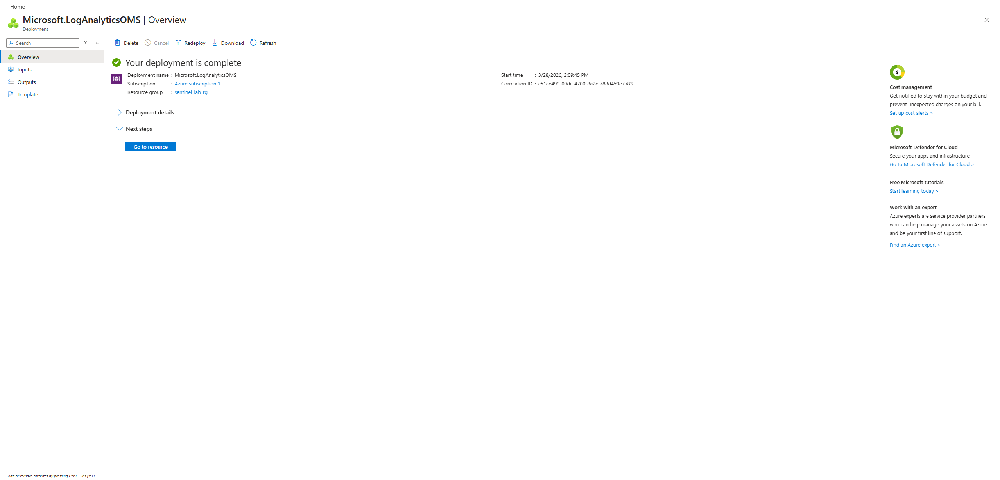

---

**Step 2: Log Analytics Workspace**

Deployed `sentinel-lab-workspace` — the data store where all logs are ingested and queried by Sentinel.

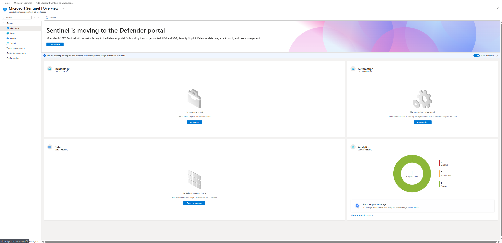

---

**Step 3: Microsoft Sentinel Deployment**

Enabled Microsoft Sentinel on top of the Log Analytics Workspace. This is the SIEM layer that provides threat detection, incident management, and SOAR capabilities.


---

### Phase 2 — Data Collection

**Step 4: Windows Security Events Connector**

Installed the **Windows Security Events** solution from the Sentinel Content Hub. This includes:
- 2 Data Connectors
- 20 Analytics Rule templates
- 2 Workbooks
- 50 Hunting Queries

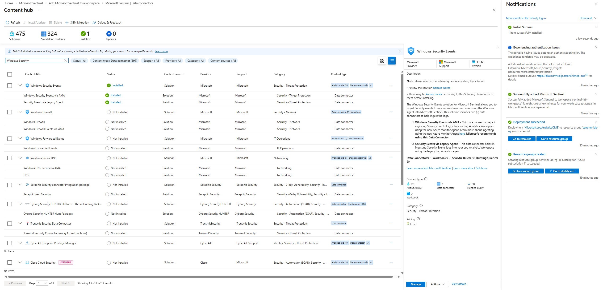

---

**Step 5: Windows Server VM Deployment**

Deployed a Windows Server 2022 Datacenter VM (`sentinel-windows-vm`) in Azure to act as a log source.

- **Size:** Standard B2ts v2
- **Region:** West Europe
- **Auto-shutdown:** 11:00 PM (cost control)

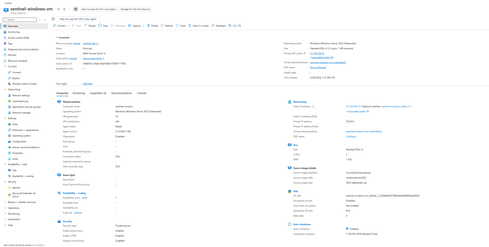

---

**Step 6: Data Collection Rule (Azure Monitor Agent)**

Created a Data Collection Rule to automatically install the Azure Monitor Agent on the VM and stream **All Security Events** to the Log Analytics Workspace.

```
Windows VM → Azure Monitor Agent → Log Analytics → Sentinel
```

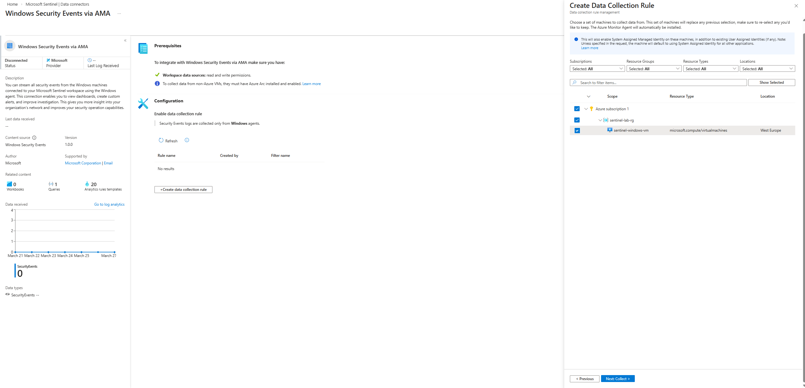

---

### Phase 3 — Threat Detection

**Step 7: RDP Connection & Attack Simulation**

Connected to the VM via RDP and simulated a brute force attack by generating multiple failed login attempts using `runas /user:fakeuser cmd`.

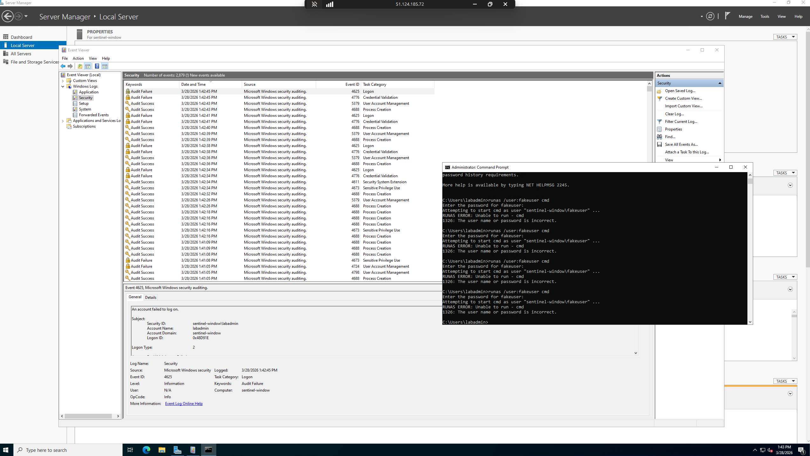

Windows Security Event **ID 4625** (Failed Logon) captured in Event Viewer.

---

**Step 8: KQL Query — Failed Logon Detection**

Ran the first KQL query in Microsoft Sentinel to detect failed logon events (Event ID 4625):

```kql
SecurityEvent
| where EventID == 4625
| project TimeGenerated, Account, Computer, EventID, Activity
| order by TimeGenerated desc
```

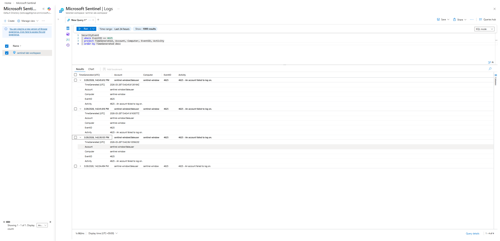

Successfully retrieved failed logon events from the `sentinel-window\fakeuser` account.

---

**Step 9: Analytics Rule — Brute Force Detection**

Created a custom scheduled Analytics Rule to automatically detect brute force attacks:

```kql
SecurityEvent
| where EventID == 4625
| summarize FailedAttempts = count() by Account, Computer, bin(TimeGenerated, 5m)
| where FailedAttempts >= 5
```

**Rule Configuration:**
- **Name:** Brute Force - Multiple Failed Logons
- **Severity:** High
- **MITRE ATT&CK:** Credential Access / T1110 - Brute Force
- **Frequency:** Every 5 minutes
- **Lookup period:** Last 5 minutes
- **Threshold:** > 0 results

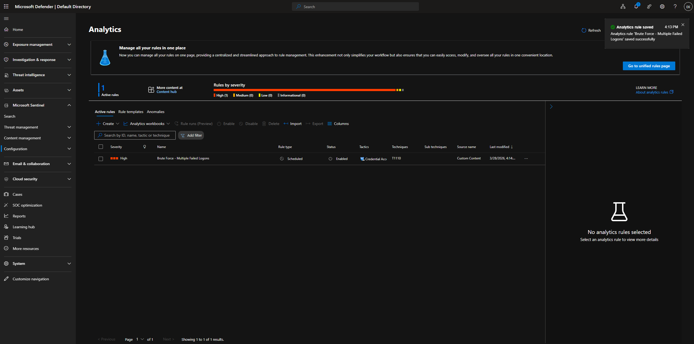

---

### Phase 4 — Incident Response

**Step 10: Brute Force Attack Simulation**

Simulated a realistic brute force attack by running 20+ failed login attempts in rapid succession on the Windows VM:

```cmd
for /L %i in (1,1,20) do runas /user:fakeuser cmd
```

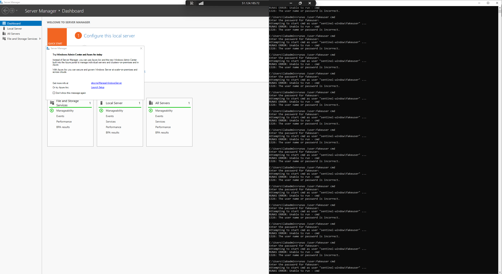

---

**Step 11: Incident Auto-Generated**

Microsoft Sentinel automatically detected the attack and created a **High severity Incident** in the Microsoft Defender portal.

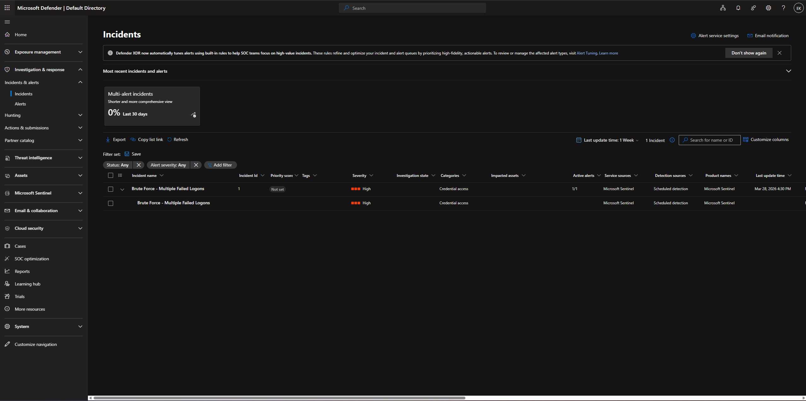

---

**Step 12: Incident Investigation**

Investigated the incident details:
- **Account targeted:** `sentinel-window\fakeuser`
- **Failed attempts detected:** 24 within 5 minutes
- **Detection time:** Real-time (within 5 minutes of attack)
- **MITRE tactic:** Credential Access

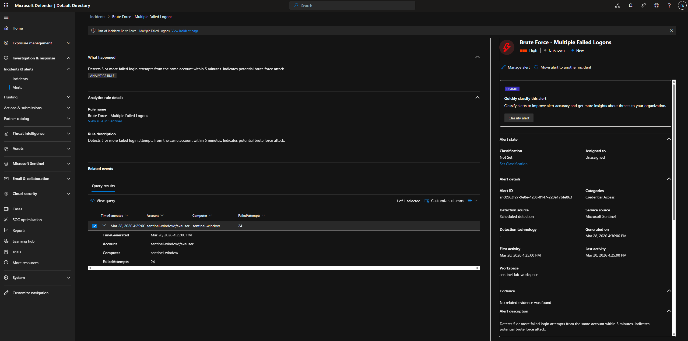

---

### Phase 5 — Automation (SOAR)

**Step 13: Logic App Deployment**

Deployed a new Azure Logic App (`sentinel-brute-force-playbook`) in the `sentinel-lab-rg` resource group, West Europe. This Logic App serves as the SOAR playbook for automated incident response.

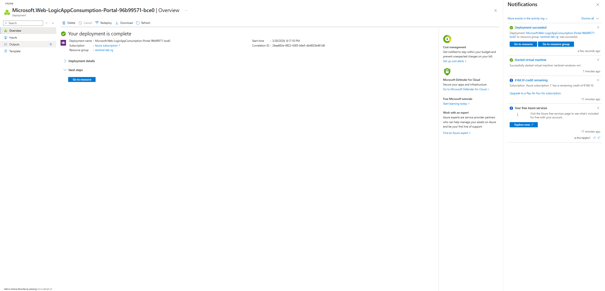

---

**Step 14: Logic App Overview**

The Logic App was created with Workflow Type: Stateful, Status: Enabled, in the sentinel-lab-rg resource group.

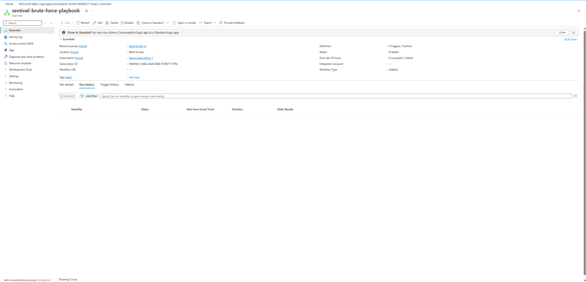

---

**Step 15: Trigger — Microsoft Sentinel Incident**

Opened the Logic App Designer and configured the **Microsoft Sentinel incident** trigger. This fires automatically whenever a new incident is created in Sentinel. Authentication used OAuth connected to the Azure tenant.

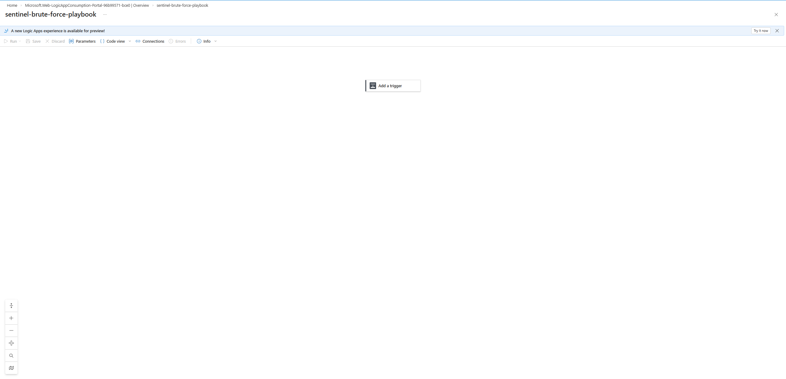

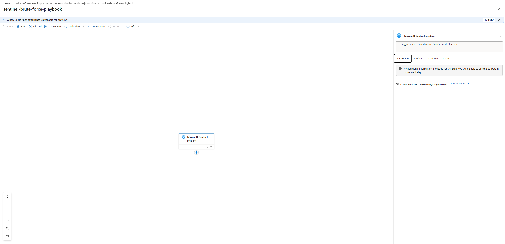

---

**Step 16: Email Action — Gmail & Outlook Integration**

Added a **Send email** action. Initially connected via Gmail (SOC-ALERT account), then finalized with **Outlook (Send an email V2)** connected to `kotsvagg83@hotmail.com`.

Configured with dynamic fields from the Sentinel incident:

- **To:** kotsvagg83@hotmail.com
- **Subject:** 🚨 Sentinel Alert: Brute Force Incident Detected
- **Importance:** High
- **Body:**
  - Incident Title (dynamic)
  - Incident Severity (dynamic)
  - Incident Status (dynamic)
  - Incident Created Time UTC (dynamic)
  - "Please investigate immediately in Microsoft Sentinel."

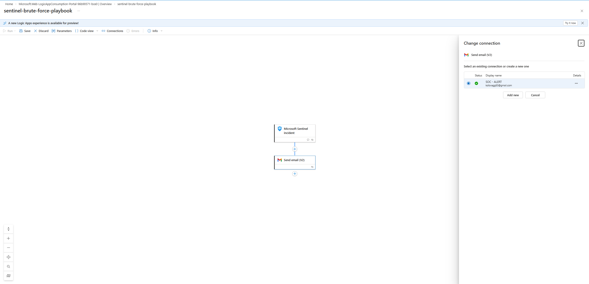

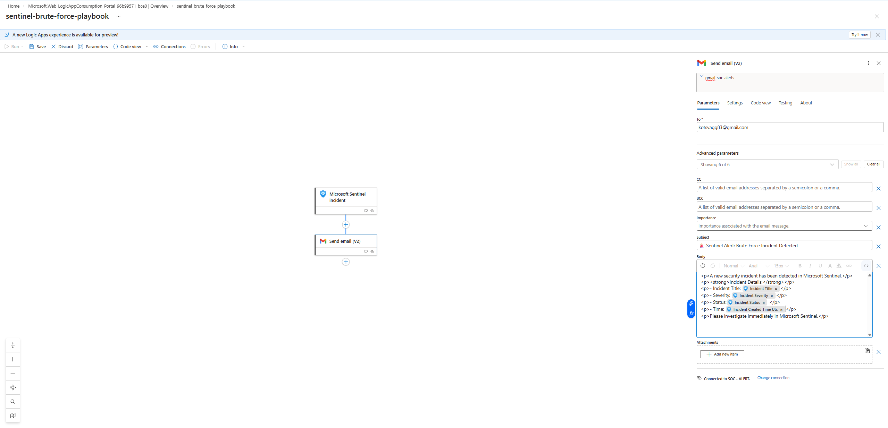

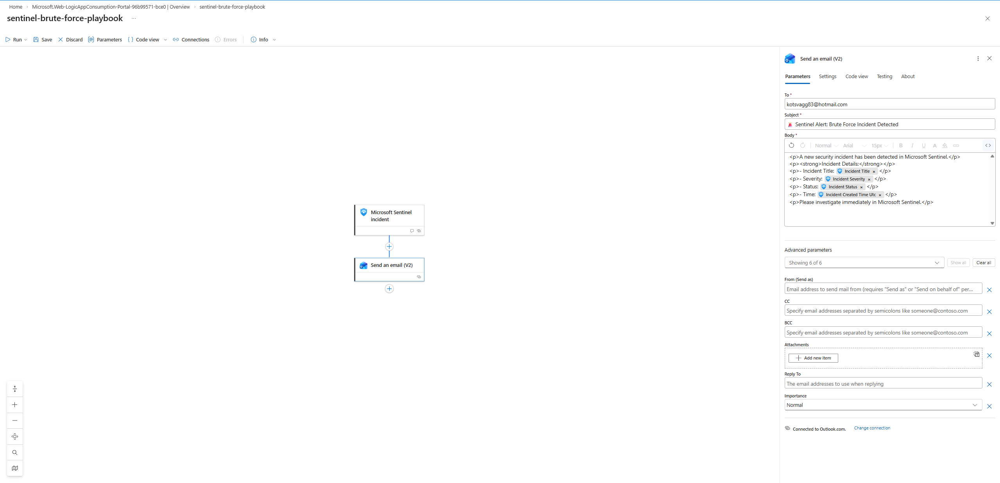

---

**Step 17: Playbook Saved Successfully**

Saved the completed Logic App workflow. Notification confirmed: "Successfully saved workflow sentinel-brute-force-playbook".

Final workflow:
```
[Microsoft Sentinel incident] → [Send an email (V2)]
```

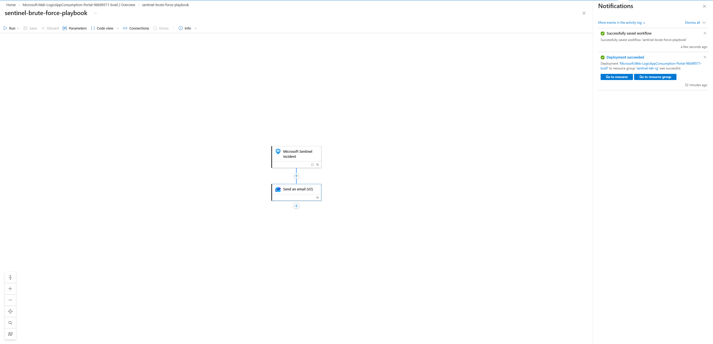

---

**Step 18: Sentinel Permissions for Playbooks**

Navigated to **Sentinel → Automation** and clicked **Configure permissions**. Granted Microsoft Sentinel permission to run playbooks by selecting the `sentinel-lab-rg` resource group.

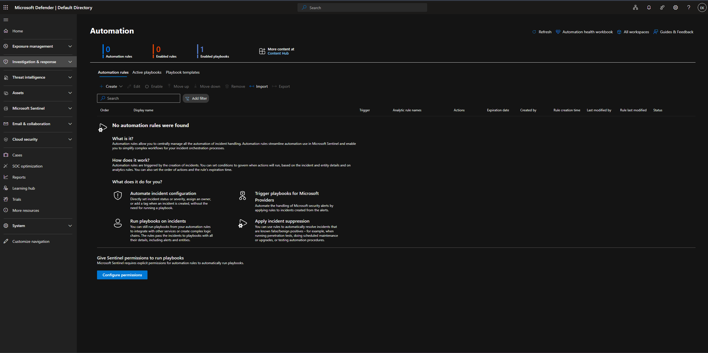

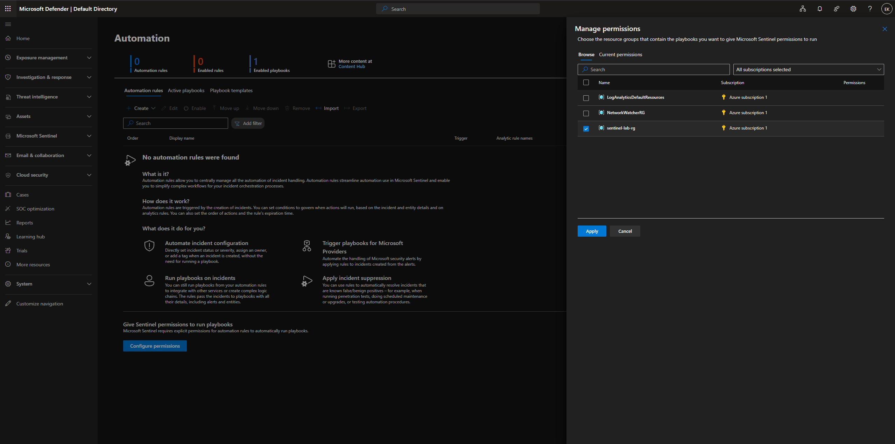

---

**Step 19: Automation Rule — Playbook Attachment**

Created an Automation Rule named **"Brute Force - Run Playbook"**:

- **Trigger:** When incident is created
- **Condition:** Analytic rule name contains "Brute Force - Multiple Failed Logons"
- **Action:** Run playbook → `sentinel-brute-force-playbook` (Azure subscription 1 / sentinel-lab-rg)
- **Expiration:** Indefinite
- **Order:** 1

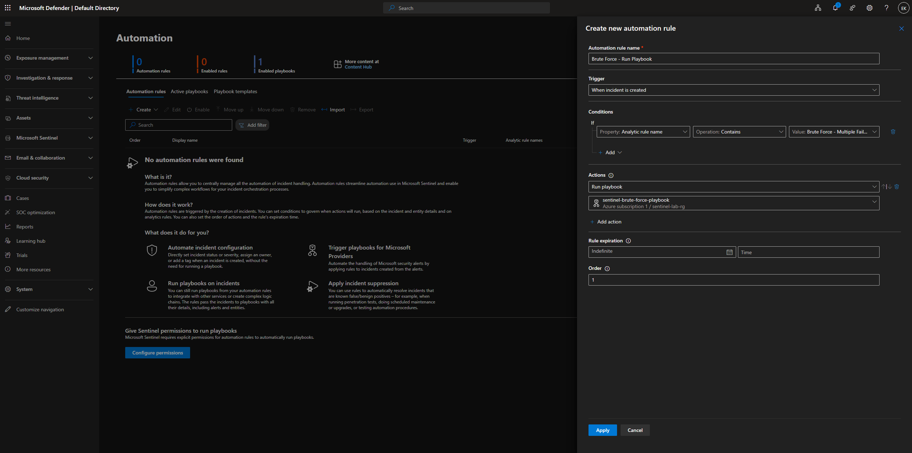

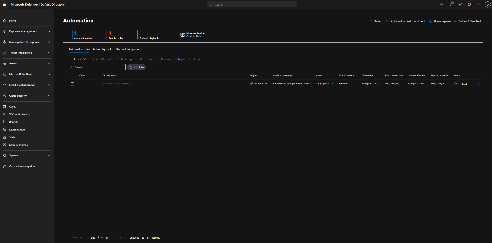

---

**Step 20: Attack Simulation & Playbook Validation**

Triggered a new brute force simulation on the VM to validate the full automation chain end-to-end:

```cmd
for /L %i in (1,1,20) do runas /user:fakeuser cmd
```

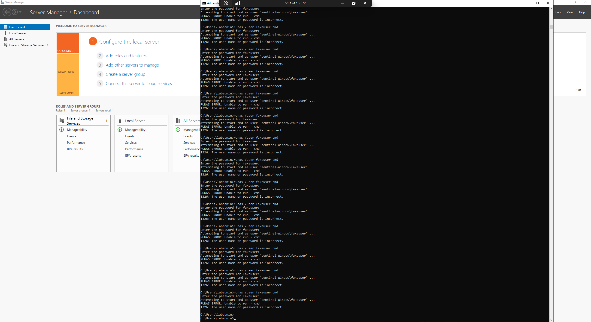

The Logic App executed successfully — **2 successful runs** visible in the Run history (9:23 PM and 9:28 PM).

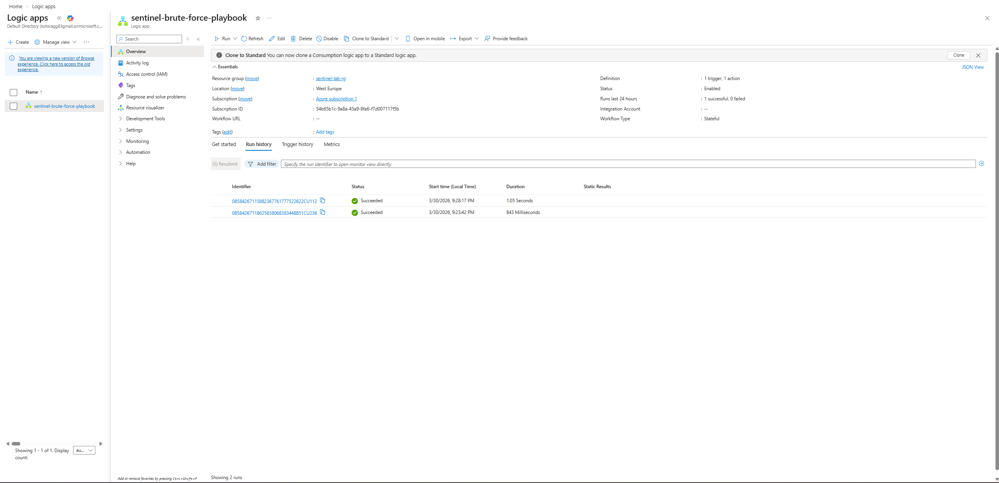

---

**Step 21: Email Alert Received ✅**

Automated email alert received in Outlook inbox with full incident details:

- **Subject:** 🚨 Sentinel Alert: Brute Force Incident Detected
- **Importance:** High
- **Incident Title:** Brute Force - Multiple Failed Logons
- **Severity:** High
- **Status:** New
- **Time:** 2026-03-30T18:26:14Z
- **Message:** "Please investigate immediately in Microsoft Sentinel."

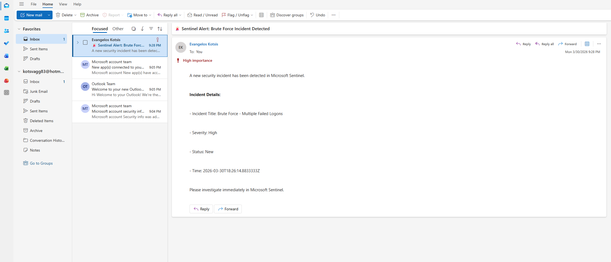

**Full SOAR chain validated:** Attack simulation → Sentinel detection → Incident created → Automation Rule triggered → Logic App executed → Email delivered. ✅

---

### Phase 6 — Additional KQL Detection Rules

**Step 22: Three Additional Analytics Rules**

Expanded detection coverage with 3 new custom rules covering the MITRE ATT&CK framework beyond brute force.

---

**Rule 1 — Successful Login After Multiple Failures**

Detects a successful login following 3+ failed attempts from the same account within 1 hour — a strong indicator of a successful brute force attack.

```kql
let FailedLogins = SecurityEvent
| where EventID == 4625
| where TimeGenerated > ago(1h)
| summarize FailedCount = count() by Account, IpAddress = IpAddress
| where FailedCount >= 3;
SecurityEvent
| where EventID == 4624
| where TimeGenerated > ago(1h)
| join kind=inner FailedLogins on Account
| project TimeGenerated, Account, IpAddress, FailedCount, Computer
| order by TimeGenerated desc
```

- **Severity:** High | **MITRE:** Credential Access / T1110
- **Frequency:** Every 5 min | **Lookup:** Last 1 hour

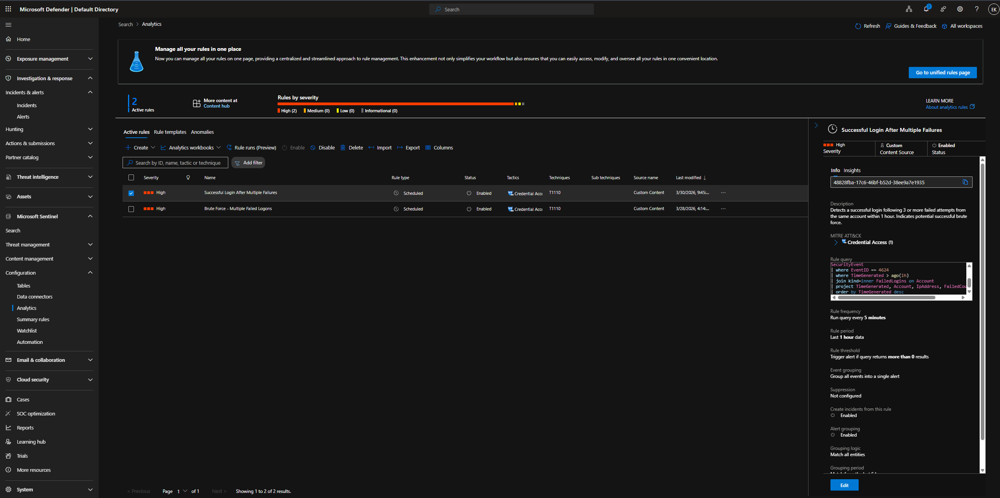

---

**Rule 2 — New User Account Created**

Detects creation of a new local user account (EventID 4720). A common persistence technique used by attackers after initial compromise.

```kql
SecurityEvent
| where EventID == 4720
| project TimeGenerated, Account, Computer, EventID
| order by TimeGenerated desc
```

- **Severity:** Medium | **MITRE:** Persistence / T1136 - Create Account
- **Frequency:** Every 5 min | **Lookup:** Last 1 hour

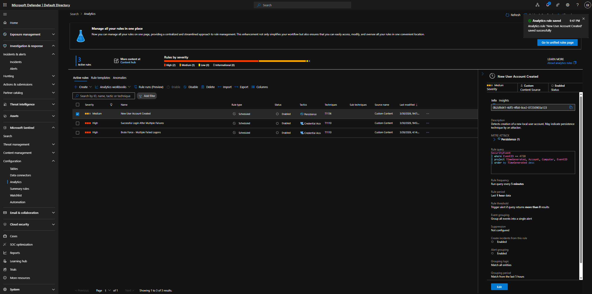

---

**Rule 3 — User Added to Admin Group**

Detects when a user is added to the local Administrators group (EventID 4732). Indicates privilege escalation.

```kql
SecurityEvent
| where EventID == 4732
| project TimeGenerated, Account, Computer, EventID
| order by TimeGenerated desc
```

- **Severity:** High | **MITRE:** Privilege Escalation / T1078 - Valid Accounts
- **Frequency:** Every 5 min | **Lookup:** Last 1 hour


---

**Step 23: Attack Simulation — All Rules**

Simulated all attack scenarios on the Windows VM:

```cmd
# Brute force
for /L %i in (1,1,10) do net use \\localhost\IPC$ /user:testuser wrongpassword 2>nul

# New user creation (persistence)
net user hacker P@ssword123! /add

# Privilege escalation
net localgroup Administrators hacker /add
```

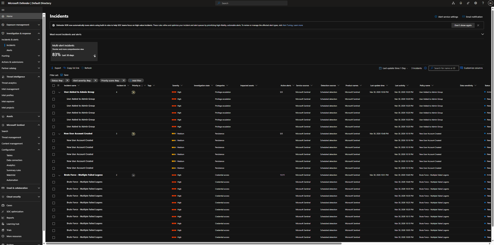

All rules triggered successfully in Microsoft Sentinel:

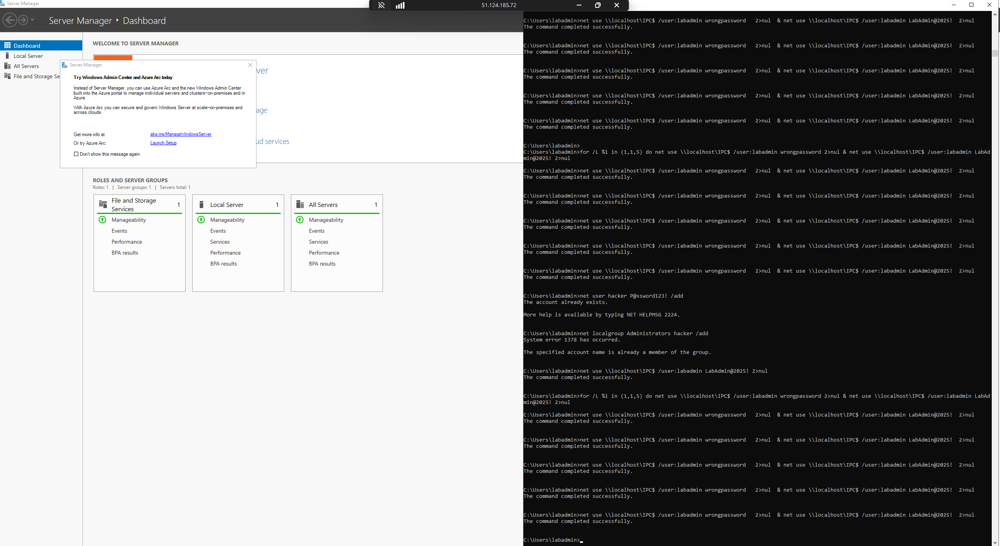

- ✅ **User Added to Admin Group** — High, Privilege escalation
- ✅ **New User Account Created** — Medium, Persistence
- ✅ **Brute Force - Multiple Failed Logons** — High, Credential access

---

### Phase 7 — SOC Dashboard

**Step 24: Custom Workbook — SOC Dashboard**

Built a custom Microsoft Sentinel Workbook (`SOC Dashboard - Azure Sentinel Lab`) with 4 live visualization panels:

| Panel | Type | What it shows |
|---|---|---|
| Incidents by Severity | Pie Chart | High vs Medium incident distribution |
| Incidents Over Time | Time Chart | Attack spike timeline |
| Top 10 Failed Login Accounts | Bar Chart | Most targeted accounts |
| Recent Incidents | Table | Latest 10 incidents with status |

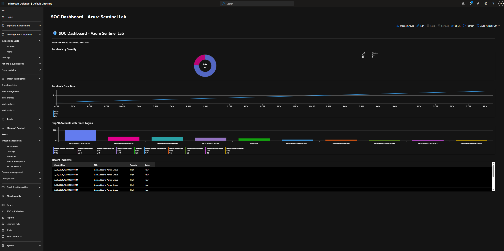

**Live data from the lab:**
- **25 total incidents** (19 High, 6 Medium)
- **Top offender:** `sentinel-window\administrator` — 605 failed attempts
- **Attack spike** clearly visible on the timeline

---

## ✅ Progress Checklist

**Phase 1 — Infrastructure Setup**
- [x] Azure subscription & resource group (`sentinel-lab-rg`)
- [x] Log Analytics Workspace (`sentinel-lab-workspace`)
- [x] Microsoft Sentinel enablement

**Phase 2 — Data Collection**
- [x] Windows Security Events connector (Content Hub)
- [x] Windows Server 2022 VM (`sentinel-windows-vm`)
- [x] Azure Monitor Agent via Data Collection Rule
- [x] All Security Events ingestion confirmed

**Phase 3 — Threat Detection**
- [x] KQL query for EventID 4625 (Failed Logon)
- [x] Analytics Rule — Brute Force (5+ attempts / 5 min)
- [x] MITRE ATT&CK mapping (T1110)

**Phase 4 — Incident Response**
- [x] Brute force simulation (20+ failed logins)
- [x] Real-time incident generation & investigation

**Phase 5 — Automation (SOAR)**
- [x] Azure Logic App deployed (`sentinel-brute-force-playbook`)
- [x] Microsoft Sentinel incident trigger (OAuth)
- [x] Outlook email action with dynamic incident fields
- [x] Sentinel permissions granted (`sentinel-lab-rg`)
- [x] Automation Rule: "Brute Force - Run Playbook"
- [x] End-to-end validated: attack → incident → email ✅

**Phase 6 — Additional Detection Rules**
- [x] Successful Login After Multiple Failures (T1110)
- [x] New User Account Created (T1136)
- [x] User Added to Admin Group (T1078)
- [x] All rules tested with live VM simulation

**Phase 7 — SOC Dashboard**
- [x] Incidents by Severity (pie chart)
- [x] Incidents Over Time (time chart)
- [x] Top 10 Failed Login Accounts (bar chart)
- [x] Recent Incidents (table)
- [x] Saved as "SOC Dashboard - Azure Sentinel Lab"

**Phase 8 — Final Documentation**
- [x] Complete README with all 8 phases
- [x] All KQL queries documented
- [x] MITRE ATT&CK coverage table
- [x] Architecture diagram
- [x] Lessons learned

---

## 🔑 Key KQL Queries

### Failed Logon Detection
```kql
SecurityEvent
| where EventID == 4625
| project TimeGenerated, Account, Computer, EventID, Activity
| order by TimeGenerated desc
```

### Brute Force Detection (5+ attempts in 5 minutes)
```kql
SecurityEvent
| where EventID == 4625
| summarize FailedAttempts = count() by Account, Computer, bin(TimeGenerated, 5m)
| where FailedAttempts >= 5
```

### Successful Login After Multiple Failures
```kql
let FailedLogins = SecurityEvent
| where EventID == 4625
| where TimeGenerated > ago(1h)
| summarize FailedCount = count() by Account, IpAddress = IpAddress
| where FailedCount >= 3;
SecurityEvent
| where EventID == 4624
| where TimeGenerated > ago(1h)
| join kind=inner FailedLogins on Account
| project TimeGenerated, Account, IpAddress, FailedCount, Computer
| order by TimeGenerated desc
```

### New User Account Created
```kql
SecurityEvent
| where EventID == 4720
| project TimeGenerated, Account, Computer, EventID
| order by TimeGenerated desc
```

### User Added to Admin Group
```kql
SecurityEvent
| where EventID == 4732
| project TimeGenerated, Account, Computer, EventID
| order by TimeGenerated desc
```

---

## 🗺️ MITRE ATT&CK Coverage

| Tactic | Technique | Detection Rule |
|---|---|---|
| Credential Access | T1110 - Brute Force | Brute Force - Multiple Failed Logons |
| Credential Access | T1110 - Brute Force | Successful Login After Multiple Failures |
| Persistence | T1136 - Create Account | New User Account Created |
| Privilege Escalation | T1078 - Valid Accounts | User Added to Admin Group |

---

## 📌 What I Learned

- How to deploy and configure Microsoft Sentinel from scratch in Azure
- How Azure Monitor Agent (AMA) collects and forwards Windows Security Events
- How to write KQL queries for real-time security event analysis
- How Analytics Rules automate threat detection and incident creation
- How to build SOAR playbooks with Azure Logic Apps for automated response
- How to integrate Sentinel with Outlook to deliver email alerts with dynamic incident data
- How to simulate real attack scenarios (brute force, persistence, privilege escalation) and verify detection
- How to build live SOC dashboards using Sentinel Workbooks
- The complete SOC workflow: log ingestion → KQL detection → incident → SOAR → email alert

---

*Part of my cybersecurity portfolio — [evank95.github.io/My-CV-Page](https://evank95.github.io/My-CV-Page/)*
